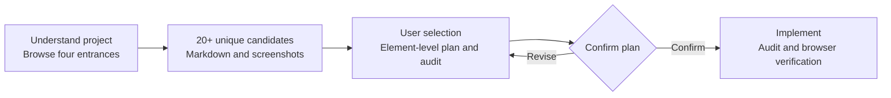

<p align="center"><a href="./README.md">简体中文</a> · <strong>English</strong></p>

<p align="center"></p>

<p align="center">
  <a href="https://github.com/fms211/frontend-inspiration-assistant/releases/tag/v0.2.0"></a>
  
  
  <a href="./LICENSE"></a>
</p>

<p align="center"><strong>Turn observed design inspiration into a concrete implementation plan.</strong></p>
<p align="center">Four design sources · 20+ unique candidates per round · Markdown and real screenshots · Element-level plans · Two complementary audits</p>

<p align="center"><a href="#quick-start">Quick start</a> · <a href="#real-browser-previews">Previews</a> · <a href="#workflow">Workflow</a> · <a href="./docs/FIRST_RUN.md">22-candidate example</a> · <a href="./docs/VALIDATION.md">Validation</a></p>

---

## What it does

A reusable frontend research and implementation workflow for agents supporting Agent Skills or MCP. It reads the project's audience, page purpose, design rules, and technology stack, then opens categories, clicks demos, and observes relevant interactions. Candidates are ranked **high → medium → low relevance**, with fit, adaptations, and implementation costs explained.

| Capability | Output |
|---|---|
| **Observe before recommending** | Visit four specified entrances, inspect individual previews, and record actions, observations, and failures |
| **20+ distinct candidates** | Merge website/source duplicates and JS, TS, CSS, and Tailwind variants |
| **Complete Markdown reports** | Candidate table, real Top5 screenshots, Top3 comparison, combinations, dependencies, and licensing |
| **Element-level plans** | Position, copy, typography, layout, tokens, motion, state transitions, interruption, and rollback |
| **Complementary audits** | Bundled UI UX Pro Max, plus impeccable when the host provides it, with rule/code/browser evidence kept distinct |
| **Cross-agent entry points** | A portable Agent Skill, ten MCP tools, CLI and client configuration generator |

### Sources checked each round

| Source | Used for |
|---|---|
| [React Bits](https://reactbits.dev/) | Components, text animation, backgrounds, scrolling, and interaction patterns |
| [React Bits GitHub](https://github.com/DavidHDev/react-bits) | Source, dependencies, implementation, and licensing; counted with the website |
| [hepengwei.cn](https://hepengwei.cn/) | CSS interactions and layout examples, with category and exact position recorded |
| [Aceternity UI](https://ui.aceternity.com/) | Layout, state feedback, component interactions, and animation patterns |

## Workflow



**Selection leads to a proposal; confirming the concrete proposal authorizes implementation.** Each round is saved in the current project's `设计灵感/<timestamp>-<target>/` directory. Previous rounds are preserved.

## Real browser previews

These screenshots were captured while visiting the source websites on 2026-09-30. They show source demos. Actions and untested behavior are documented in the [22-candidate example](./docs/FIRST_RUN.md).

<table>
  <tr>
    <td width="50%"><strong>01 · Send feedback</strong><br><br>Loading appeared after a click; the success moment was not captured.</td>
    <td width="50%"><strong>02 · History and tasks</strong><br><br>A list item was clicked; keyboard navigation remains untested.</td>
  </tr>
  <tr>
    <td><strong>03 · Multi-stage waiting</strong><br><br>Step progression was observed; adapt it to real task events.</td>
    <td><strong>04 · Asset upload</strong><br><br>Appearance and source were inspected; file selection and drop were not tested.</td>
  </tr>
  <tr>
    <td><strong>05 · Tab switching</strong><br><br>Switching to Services changed both content and the selection indicator.</td>
    <td><strong>Choose by purpose</strong><br><br>Send feedback: 01<br>History and task finding: 02<br>Long-running generation: 03<br><br>Suggested combination: <strong>01 + 03 + 06</strong><br>Asset workflow: <strong>02 + 04 + 05</strong></td>
  </tr>
</table>

## Quick start

Version 0.2.0 provides **Agent Skills + MCP + CLI** for Claude Code, Cursor, Codex and compatible agent tools. Once the skill is loaded or MCP connected, the host can select it by task. See the [cross-agent guide](./docs/CROSS-AGENT.en.md) for setup, capabilities and tested limits.

| Entry | Purpose |
|---|---|
| [Agent Skill](./plugin/SKILL.md) | Discover the frontend/UI/motion workflow with a complete, self-contained runtime |
| [MCP stdio](./plugin/scripts/mcp_server.py) | Ten tools, five resources and one starting prompt for agents to discover and call |
| [CLI](./plugin/scripts/inspiration.py) | Rule search, evidence validation, reports, proposals and packaging |

Report tools use Python 3.10+ and its standard library. Optional MCP uses a pinned official SDK. Browse with actual host tools, and reuse frontend-design/impeccable when available; disclose missing capabilities. User language requirements override the packaged Chinese default.

### Install the Agent Skill

Clone, replace the example with your existing project's absolute path, and choose one client command:

```bash
git clone https://github.com/fms211/frontend-inspiration-assistant.git
cd frontend-inspiration-assistant
python plugin/scripts/install_skill.py --project "/absolute/path/to/my-site" --client claude
python plugin/scripts/install_skill.py --project "/absolute/path/to/my-site" --client cursor
```

The installer preserves existing skills and global settings. MCP, optional browser tools and other client settings are covered in the [setup guide](./docs/CROSS-AGENT.en.md).

### Codex plugin mode

Clone this public repository and use Codex's supported local marketplace flow:

```bash
git clone https://github.com/fms211/frontend-inspiration-assistant.git
cd frontend-inspiration-assistant
codex plugin marketplace add .
codex plugin add frontend-inspiration-assistant@frontend-inspiration-assistant-source
```

The source marketplace is defined in [.agents/plugins/marketplace.json](./.agents/plugins/marketplace.json), and the runtime lives in [plugin/](./plugin/). An enabled 0.1 private instance keeps its original workflow; install this source or portable bundle for 0.2 features. Download the portable 0.2.0 archive from the [release](https://github.com/fms211/frontend-inspiration-assistant/releases/tag/v0.2.0).

### Example requests

> Find at least 20 UI and motion inspirations for this project's task panel. Rank relevance, save Markdown and five real screenshots, then let me choose.

> I choose 01, 03, and 06. Specify each element's position, copy, visual parameters, and motion behavior before I confirm implementation.

> Audit this page with the bundled UI UX Pro Max and impeccable. Distinguish rule suggestions, code inspection, and browser tests.

## Three skill entry points

| Skill | Purpose |
|---|---|
| [frontend-inspiration](./plugin/skills/frontend-inspiration/SKILL.md) | Project context, autonomous browsing, candidate reporting, selection, and implementation workflow |
| [frontend-audit](./plugin/skills/frontend-audit/SKILL.md) | Audit candidates, element-level plans, or pages |
| [ui-ux-pro-max](./plugin/skills/ui-ux-pro-max/SKILL.md) | Fully bundled rule search, data, and stack-specific audit guidance |

### What a concrete proposal specifies

| Area | Required details |
|---|---|
| Page and location | Route, region, parent UI, visible label, and relative position |
| Copy | Current/proposed wording, family, size, weight, line height, and letter spacing |
| Layout and visuals | Dimensions, spacing, hierarchy, mobile adaptations, tokens, radius, borders, opacity, and shadows |
| Motion | Trigger, start/end, duration, delay, easing, amplitude, repetition, interruption, and reduced motion |
| Implementation | Components, dependencies, steps, expected outcome, acceptance checks, and rollback |

Use concrete values or explicit project tokens. Keep **observed source values** separate from **proposed implementation values**. User requirements and project constraints override generic style advice.

## Validation and reproduction

```bash
python -m pip install -r plugin/requirements-mcp.txt
python -m unittest discover -s plugin/tests -v
python plugin/scripts/inspiration.py package-check
python plugin/skills/ui-ux-pro-max/scripts/validate_data.py
python plugin/scripts/inspiration.py audit-rules "animation reduced motion" --domain ux
```

Use `python` on Windows; substitute `python3` on macOS/Linux if needed. More commands are in the [runtime guide](./plugin/README.md).

| Completed check | Result |
|---|---|
| 17 original contract tests | Deduplication, 19-result failure, ordering, screenshots, source failure, missing data, and exit0 error handling passed |
| 15 cross-agent tests | Nine portability tests and six actual MCP subprocess tests; modern/legacy handshakes and all tools/resources/prompt passed |
| Official data integrity | 12 domains, 22 stack datasets, and ui-reasoning.csv validated; 94 upstream file hashes recorded |
| One actual research round | Four entrances, 22 unique candidates, real Top5 screenshots, and a Markdown report |
| Selection-to-plan handoff | A clearly marked test fixture verified fields and candidate IDs without implying user selection |
| Installation and discovery | Original 0.1 private plugin installed; 0.2 directory installation and JSON/TOML validated; specific client UI and automatic selection untested |

Post-implementation desktop, mobile, keyboard, reduced-motion, and performance checks run after user selection, proposal confirmation, and implementation. Vue/HTML cases are compatibility projections rather than additional browser rounds. Without MCP dependencies, six protocol tests skip; that is not a full 32-test pass. See the [validation record](./docs/VALIDATION.md) and [cross-agent evidence](./docs/CROSS-AGENT.en.md).

## Repository structure

```text
frontend-inspiration-assistant/
├── README.md / README.en.md       # Chinese and English guides
├── .agents/plugins/              # Installable source marketplace
├── docs/                         # Real previews, example, and validation
└── plugin/                       # Portable runtime
    ├── SKILL.md                  # Portable Agent Skill
    ├── plugin.json               # Standard manifest
    ├── .codex-plugin/            # Platform-generated Codex compatibility manifest
    ├── skills/                   # Three entry points
    ├── scripts/                  # MCP, installation, configs, reports, audits
    ├── templates/                # Candidate, proposal, and audit templates
    └── tests/                    # 32 contract, portability and MCP tests
```

## License and attribution

Original plugin code uses the [MIT license](./LICENSE). UI UX Pro Max is bundled from the [pinned official commit](https://github.com/nextlevelbuilder/ui-ux-pro-max-skill/tree/09170eec67eefd46a7ae85de61b40c194020f997), retaining its [original MIT notice](./plugin/skills/ui-ux-pro-max/LICENSE) and [version/integrity record](./plugin/skills/ui-ux-pro-max/UPSTREAM.json).

React Bits uses [MIT + Commons Clause](https://github.com/DavidHDev/react-bits/blob/main/LICENSE.md). Verify the exact source license for selected Aceternity free components and hepengwei examples before implementation. Their component source is not bundled here. Screenshots are attributed design-research material; they do not claim current-project implementation or comprehensive component verification.

<p align="center"><sub>Explore with evidence. Implement with context.</sub></p>
