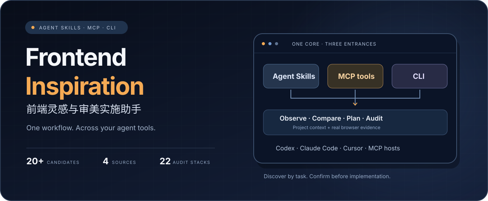
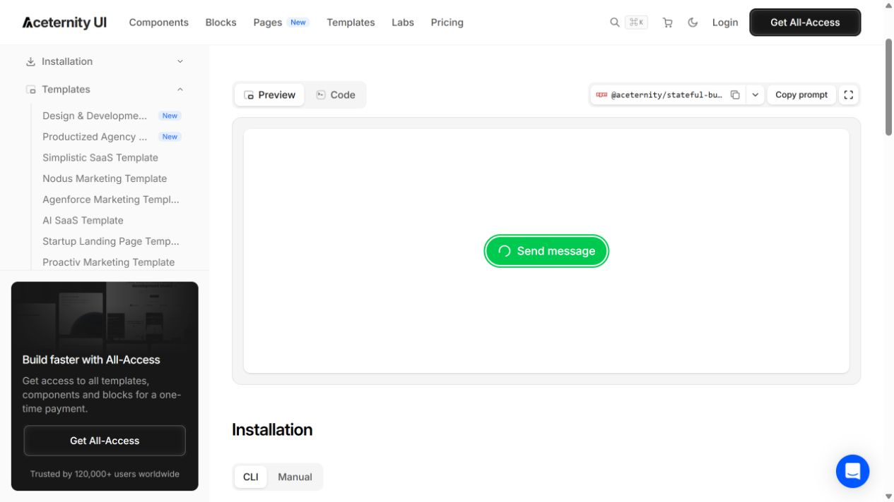
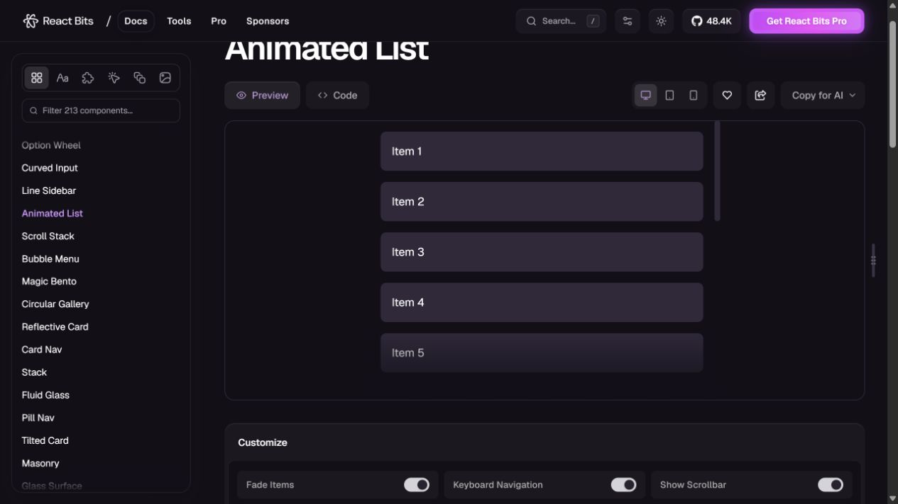
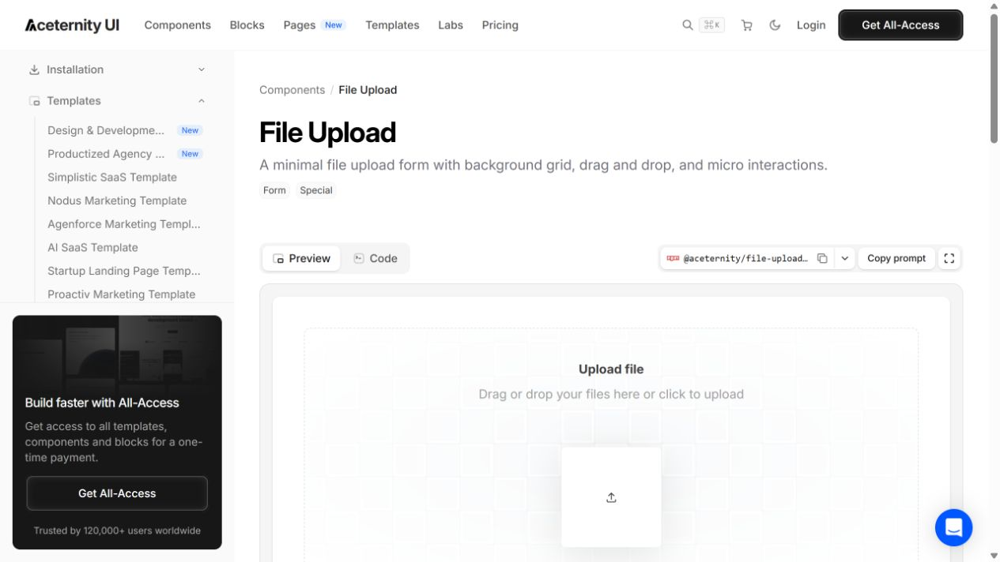
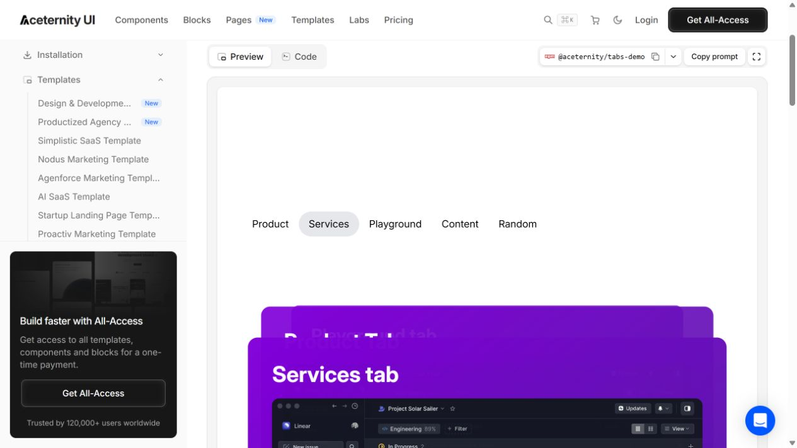

<p align="center"><strong>简体中文</strong> · <a href="./README.en.md">English</a></p>

<p align="center"></p>

<p align="center">
  <a href="https://github.com/fms211/frontend-inspiration-assistant/releases/tag/v0.2.0"></a>
  
  
  <a href="./LICENSE"></a>
</p>

<p align="center"><strong>从真实浏览的灵感，到可确认、可实施、可审计的页面方案。</strong></p>
<p align="center">四个设计来源 · 每轮20+去重候选 · Markdown与真实截图 · 逐元素参数 · 双重设计审计</p>

<p align="center"><a href="#快速开始">快速开始</a> · <a href="#真实浏览预览">真实预览</a> · <a href="#完整工作流程">工作流程</a> · <a href="./docs/FIRST_RUN.md">22条案例</a> · <a href="./docs/VALIDATION.md">验收记录</a></p>

---

## 它能帮你做什么

为支持 Agent Skills 或 MCP 的智能体提供跨项目复用的前端灵感与实施工作流。先理解项目的用户、页面用途、设计规范与技术栈，再自主打开分类、点击演示和观察交互；推荐结果按**高 → 中 → 低相关度**排序，解释适配理由与代价。

| 能力 | 交付 |
|---|---|
| **看过再推荐** | 检查四个指定入口，逐页查看组件，记录动作、观察及访问失败 |
| **20+有效候选** | 合并官网／源码及JS、TS、CSS、Tailwind变体，不重复凑数 |
| **完整Markdown** | 候选表、Top5真实截图、前三条比较、组合方向和授权情况 |
| **逐元素方案** | 位置、文案、字体、布局、token、动效参数、状态、中断与回退 |
| **双重审计** | 内置UI UX Pro Max，宿主impeccable可用时参与；区分规则、代码和浏览器实测 |
| **跨智能体调用** | 通用Agent Skill、10个MCP工具、CLI与客户端配置生成器 |

### 每轮检查的来源

| 来源 | 主要用途 |
|---|---|
| [React Bits](https://reactbits.dev/) | 组件、文字动画、背景、滚动与交互动效 |
| [React Bits GitHub](https://github.com/DavidHDev/react-bits) | 核实源码、依赖、实现方式与授权；与官网合并计数 |
| [hepengwei.cn](https://hepengwei.cn/) | CSS交互、页面排版与具体示例；记录分类和位置 |
| [Aceternity UI](https://ui.aceternity.com/) | 页面结构、状态反馈、组件交互与动画模式 |

## 完整工作流程


**候选选择后先拟定方案，确认具体方案后实施。** 每轮结果保存在当前项目的 `设计灵感/<日期时间>-<目标>/`，保留各轮记录。

## 真实浏览预览

以下是2026-09-30实际浏览来源网站时保存的截图。它们展示来源演示外观，逐条操作和未测试项见[22条案例](./docs/FIRST_RUN.md)。

<table>
  <tr>
    <td width="50%"><strong>01 · 发送状态</strong><br><br>点击后出现加载标记；成功瞬间未捕获。</td>
    <td width="50%"><strong>02 · 历史与任务列表</strong><br><br>点击列表项；键盘导航尚未实测。</td>
  </tr>
  <tr>
    <td><strong>03 · 多阶段等待</strong><br><br>已观察步骤推进；适配时绑定真实任务阶段。</td>
    <td><strong>04 · 素材上传</strong><br><br>查看外观与源码；文件选择、拖放未测。</td>
  </tr>
  <tr>
    <td><strong>05 · 标签切换</strong><br><br>切换Services后，内容与选中指示器变化。</td>
    <td><strong>如何挑选</strong><br><br>发送反馈：01<br>历史和任务查找：02<br>长耗时生成阶段：03<br><br>推荐组合：<strong>01 + 03 + 06</strong><br>素材方向：<strong>02 + 04 + 05</strong></td>
  </tr>
</table>

## 快速开始

0.2.0提供**Agent Skills + MCP + CLI**三个入口，可接入Claude Code、Cursor、Codex和兼容的智能体工具。加载技能或连接MCP后，宿主可按任务匹配调用。完整[跨智能体安装指南](./docs/CROSS-AGENT.md)说明配置、能力与实测边界。

| 入口 | 用途 |
|---|---|
| [Agent Skill](./plugin/SKILL.md) | 按前端/UI/动效任务发现并读取工作流，完整脚本与数据随技能安装 |
| [MCP stdio](./plugin/scripts/mcp_server.py) | 10个工具、5个资源和1个prompt，供智能体发现和调用 |
| [CLI](./plugin/scripts/inspiration.py) | 命令行规则搜索、证据校验、报告、方案和打包 |

报告CLI只需Python 3.10+标准库；可选MCP入口使用固定官方SDK。浏览使用宿主真实工具，frontend-design与impeccable可用时复用；缺失时如实报告覆盖限制。

### Agent Skill安装

克隆后，把示例路径替换为当前已有项目的绝对路径，选择对应客户端的一条命令：

```bash
git clone https://github.com/fms211/frontend-inspiration-assistant.git
cd frontend-inspiration-assistant
python plugin/scripts/install_skill.py --project "D:/Projects/my-site" --client claude
python plugin/scripts/install_skill.py --project "D:/Projects/my-site" --client cursor
```

安装器保留已有技能，不修改全局设置。MCP接入、可选浏览器及其他客户端配置见[接入指南](./docs/CROSS-AGENT.md)。

### Codex插件模式

克隆公开仓库，并通过Codex支持的本地市场安装：

```bash
git clone https://github.com/fms211/frontend-inspiration-assistant.git
cd frontend-inspiration-assistant
codex plugin marketplace add .
codex plugin add frontend-inspiration-assistant@frontend-inspiration-assistant-source
```

源码市场清单在[.agents/plugins/marketplace.json](./.agents/plugins/marketplace.json)，运行包在[plugin/](./plugin/)。已启用的0.1私有实例可继续使用原流程；0.2功能需要安装本版源码或通用包。打包好的0.2.0通用安装包可从[Release下载](https://github.com/fms211/frontend-inspiration-assistant/releases/tag/v0.2.0)。

### 直接这样说

> 为当前项目的任务面板搜集至少20条UI与动效灵感，按相关度排序，保存Markdown和前五条截图，再让我选择。

> 我选择01、03、06。先给出每个元素的位置、文案、视觉和动效参数，确认后实施。

> 用内置UI UX Pro Max和impeccable审计当前页面，区分规则建议、代码检查与浏览器实测。

## 三个技能入口

| 技能 | 用途 |
|---|---|
| [frontend-inspiration](./plugin/skills/frontend-inspiration/SKILL.md) | 项目理解、自主浏览、候选报告、选择和实施流程 |
| [frontend-audit](./plugin/skills/frontend-audit/SKILL.md) | 候选、逐元素方案或页面的双重审计 |
| [ui-ux-pro-max](./plugin/skills/ui-ux-pro-max/SKILL.md) | 完整内置规则搜索、数据与技术栈审计能力 |

### 方案必须具体到什么程度

| 项目 | 必须说明 |
|---|---|
| 页面与位置 | 路由、区域、父级UI、可见名称、相对位置 |
| 文字 | 当前与拟用文案、字体、字号、字重、行高、字距 |
| 布局与视觉 | 尺寸、间距、层级、移动端、颜色/token、圆角、边框、透明度和阴影 |
| 动效 | 触发、起止状态、时长、延迟、缓动、幅度、循环、中断及减动效 |
| 实施与验收 | 对应组件、依赖、操作步骤、预期效果、验收与回退 |

所有参数使用具体值或明确项目token，区分**原效果观察值**和**拟实施值**。用户要求及项目约束优先于通用风格建议。

## 验证与复现

```bash
python -m pip install -r plugin/requirements-mcp.txt
python -m unittest discover -s plugin/tests -v
python plugin/scripts/inspiration.py package-check
python plugin/skills/ui-ux-pro-max/scripts/validate_data.py
python plugin/scripts/inspiration.py audit-rules "animation reduced motion" --domain ux
```

Windows可直接使用`python`；macOS/Linux按环境替换为`python3`。更多命令见[运行包说明](./plugin/README.md)。

| 已完成 | 验收结果 |
|---|---|
| 17项原契约测试 | 去重、19条不足、排序、截图、来源失败、数据缺失、exit0错误等分支通过 |
| 跨智能体新增15项测试 | 9项可移植性＋6项真实MCP进程测试；现代/legacy握手、全部工具、资源与prompt通过 |
| 官方数据完整性 | 12类领域、22套栈数据、ui-reasoning.csv通过；94个原文件SHA256记录 |
| 实际浏览一轮 | 四个入口、22个不同候选、Top5真实截图和Markdown报告 |
| 选择到方案衔接 | test-fixture验证字段与候选编号，明确没有用户选择授权 |
| 安装与发现 | 原0.1私有插件已安装；0.2四种目录安装和JSON/TOML验证通过，具体客户端UI与自动选用未测 |

实施后桌面、移动端、键盘、减动效及性能实测，在用户选定并确认方案、完成实施后执行。Vue/HTML验收为兼容性投影，不是新增浏览轮次。未安装MCP依赖时6项协议测试会跳过，不能视为完整32项通过。详情见[验收记录](./docs/VALIDATION.md)及[跨智能体验收](./docs/CROSS-AGENT.md)。

## 仓库结构

```text
frontend-inspiration-assistant/
├── README.md / README.en.md       # 中英文展示与使用指南
├── .agents/plugins/              # 可安装的源码市场
├── docs/                         # 真实预览、案例与验收
└── plugin/                       # 可移植运行包
    ├── SKILL.md                  # 通用Agent Skill入口
    ├── plugin.json               # 标准插件清单
    ├── .codex-plugin/            # 平台生成的Codex兼容清单
    ├── skills/                   # 三个技能入口
    ├── scripts/                  # MCP、安装、配置、报告与审计
    ├── templates/                # 候选、方案与审计模板
    └── tests/                    # 32项契约、可移植性与MCP测试
```

## 授权与来源

插件自有代码采用[MIT](./LICENSE)。内置UI UX Pro Max来自[官方固定提交](https://github.com/nextlevelbuilder/ui-ux-pro-max-skill/tree/09170eec67eefd46a7ae85de61b40c194020f997)，保留[原MIT声明](./plugin/skills/ui-ux-pro-max/LICENSE)及[版本与完整性记录](./plugin/skills/ui-ux-pro-max/UPSTREAM.json)。

React Bits实际许可为[MIT + Commons Clause](https://github.com/DavidHDev/react-bits/blob/main/LICENSE.md)；Aceternity免费组件具体源码许可与hepengwei源码授权需按所选条目核实。本仓库没有封装这些网站的组件源码。预览截图用于注明来源的设计研究，不代表当前项目已实施或原组件已通过全部交互验收。

<p align="center"><sub>Explore with evidence. Implement with context.</sub></p>
